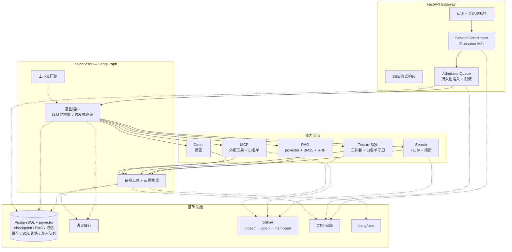
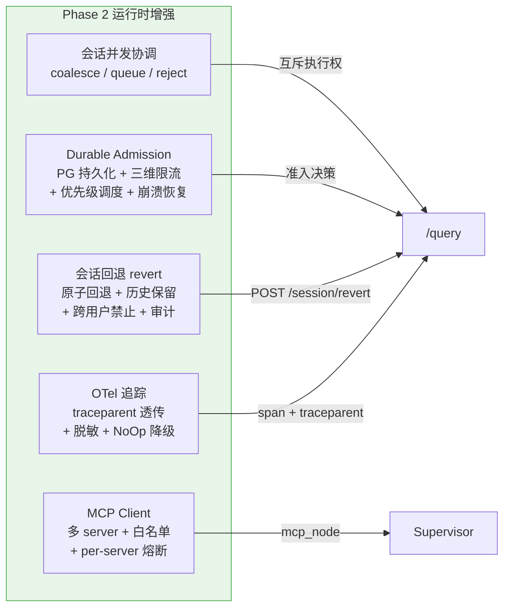

<div align="center">

# Agent Platform

**统一生产级 Agent 平台 — Supervisor 编排 + 多能力链路 + 运行时增强**

[](https://github.com/Light-Towers/agent-platform/actions/workflows/agent-platform-ci.yml)
[](https://www.python.org/downloads/)
[](LICENSE)

</div>

---

## 概述

Agent Platform 是一个基于 **LangGraph Supervisor 模式** 的统一智能体平台，将联网搜索、本地知识库（RAG）、Text-to-SQL、外部工具调用（MCP）四条能力链路统一编排在一个单进程多节点架构中。平台在设计上针对生产环境常见缺陷模式（懒加载竞态、降级不复位、会话劫持、微服务 SSE 聚合等）逐一设防，并在 Phase 2 引入会话并发协调、持久化准入控制、会话回退、分布式追踪、MCP 协议支持五项运行时增强能力。

### 核心设计原则

| 原则 | 实现 |
|------|------|
| **单进程多节点隔离** | LangGraph 节点边界隔离，避免微服务适配层的 SSE/会话键连环 bug |
| **全链路降级** | 无 LLM → 启发式路由；无 PG → 内存模式；无 API Key → 直答链路 |
| **零配置冒烟** | `DATABASE_URL=` 空即可跑通，所有可选能力 opt-in |
| **可复位降级** | 熔断器 closed → open → half-open 状态机，成功后自动复位 |
| **安全优先** | SQL 双保险（白名单 + 只读）、会话防劫持、问题脱敏 |

---

## 特性

### Phase 1 — 核心能力

- **Supervisor 编排**（`app/agent/graph.py`）：意图路由 → 子能力执行 → 证据汇总 → 反思重试，LLM 结构化路由失败时回退确定性启发式
- **联网搜索**（`app/subagents/search.py`）：Tavily API + 熔断器保护，超时/错误自动降级
- **混合检索 RAG**（`app/subagents/rag.py` + `app/rag/`）：文档导入 → 语义切分 → pgvector 向量检索 + BM25 关键词检索 → RRF 融合排序
- **Text-to-SQL**（`app/subagents/sql_agent.py` + `app/sql/`）：训练三件套（DDL + 业务文档 + 问题-SQL 范例）→ sqlglot 白名单守卫 → 连接级只读执行
- **长期记忆**（`app/memory/longterm.py`）：pgvector 语义召回历史对话，跨会话上下文关联
- **语义缓存**（`app/infra/cache.py`）：余弦距离阈值判定同义命中，命中时跳过编排直接返回
- **上下文压缩**（`app/agent/compact.py`）：多轮会话 token 超阈值时自动摘要旧消息，参考 Claude Code / Codex / OpenCode
- **熔断器**（`app/infra/circuit_breaker.py`）：closed → open → half-open 状态机，连续失败达阈值后熔断，冷却窗口到期放行试探
- **LLM 主备降级**（`app/agent/llm.py`）：主模型超时/错误时自动切换 fallback 模型
- **SSE 流式响应**：route → evidence → answer → done 全链路流式
- **认证 + 会话防劫持**（`app/api/auth.py`）：API_KEY 启用时按密钥派生 thread_id，忽略客户端传入值
- **Checkpoint 持久化**：Postgres（生产）/ Memory（开发），会话状态可恢复
- **评测门禁**（`eval/`）：12 条 golden set，启发式路由准确率基线 100%，CI 阻断回归

### Phase 2 — 运行时增强

- **会话并发协调**（`app/infra/coordinator.py`）：per-session `asyncio.Lock` 互斥，同 session 串行 / 异 session 并发；支持 coalesce（合并）/ queue（排队）/ reject（拒绝）三策略
- **Durable Admission**（`app/infra/admission.py`）：PG 持久化准入队列 + 三维滑动窗口限流（per-user / per-session / global）+ 优先级调度 + 崩溃恢复；不存储问题全文（脱敏约束）
- **会话回退**（`app/infra/revert.py`）：Checkpoint 级原子回退，不删除历史 checkpoint（支持 redo），跨用户禁止，异步审计日志
- **OTel 分布式追踪**（`app/infra/otel.py`）：OpenTelemetry 接线，W3C traceparent 透传，问题脱敏（仅记录长度 + 哈希），与 Langfuse 共存，exporter 可插拔（otlp/jaeger/console/none）
- **MCP Client**（`app/infra/mcp_client.py` + `app/subagents/mcp.py`）：多 MCP server 连接管理（stdio + SSE transport），工具白名单校验，per-server 独立熔断器隔离故障域，调用审计

---

## 架构





---

## 快速开始

### 零依赖冒烟（开发模式）

```bash
pip install -e ".[dev]"
DATABASE_URL= uvicorn app.main:app --port 8000
```

无需 PostgreSQL、无需 LLM API Key，直答链路即可跑通。

### 完整模式（Docker）

```bash
cp .env.example .env    # 填入 LLM_API_KEY / SEARCH_API_KEY 等
docker compose up -d    # pgvector + 服务（127.0.0.1:8000）
```

### 可选依赖

```bash
pip install -e ".[otel,mcp,pdf,dev]"
```

| Extra | 用途 |
|-------|------|
| `otel` | OpenTelemetry SDK + OTLP exporter |
| `mcp` | MCP SDK（外部工具调用） |
| `pdf` | PDF 文档解析（pypdf） |
| `dev` | pytest + ruff |

---

## API 参考

### `POST /query` — 问答（SSE 流式）

```bash
curl -N -X POST http://127.0.0.1:8000/query \
  -H "Content-Type: application/json" \
  -H "X-Priority: high" \
  -d '{"question": "什么是检索增强生成"}'
```

SSE 事件流：

```
data: {"type": "admission", "status": "queued", "position": 3}     # 准入排队（Phase 2）
data: {"type": "coordination", "decision": "queue"}                # 协调排队（Phase 2）
data: {"type": "route", "capability": "rag", "reason": "..."}      # 路由决策
data: {"type": "evidence", "node": "rag", "count": 4, "preview": "..."}  # 证据
data: {"type": "answer", "text": "..."}                            # 最终回答
data: {"type": "done", "thread_id": "...", "answer": "..."}        # 完成
```

| 参数 | 位置 | 说明 |
|------|------|------|
| `question` | body | 问题文本（1–2000 字符） |
| `priority` | body / `X-Priority` header | `high` / `normal` / `low`，默认 `normal` |
| `thread_id` | body | 会话 ID（启用 API_KEY 时忽略，按密钥派生） |
| `traceparent` | header | W3C Trace Context 透传（Phase 2） |

### `POST /import` — 知识库文档导入

```bash
curl -X POST http://127.0.0.1:8000/import -F "file=@document.md"
```

支持 `.md` / `.txt` / `.pdf`，自动切分 + 向量化入库。

### `POST /sql/train` — Text-to-SQL 训练

```bash
curl -X POST http://127.0.0.1:8000/sql/train \
  -H "Content-Type: application/json" \
  -d '{
    "ddl": "CREATE TABLE orders(id INT, region TEXT, amount DECIMAL)",
    "documentation": "region 取值 east/west；GMV = amount 求和",
    "question": "上季度华东区 GMV",
    "sql": "SELECT SUM(amount) FROM orders WHERE region = ''east''"
  }'
```

### `POST /session/revert` — 会话回退（Phase 2）

```bash
curl -X POST http://127.0.0.1:8000/session/revert \
  -H "Content-Type: application/json" \
  -d '{"session_id": "thread-xxx", "checkpoint_id": "cp-yyy"}'
```

将会话状态回退至指定 checkpoint，不删除历史（支持 redo）。

### `GET /health` — 健康检查

```bash
curl http://127.0.0.1:8000/health
```

```json
{
  "status": "ok",
  "storage": "postgres",
  "llm": true,
  "search": true,
  "sql_backend": "sqlite",
  "coordination": true,
  "admission": false,
  "revert": true,
  "otel": false,
  "mcp": false
}
```

---

## 配置

所有配置通过环境变量注入（pydantic-settings 校验），`extra="ignore"` 保证未知变量不报错。

### 核心配置

| 变量 | 默认值 | 说明 |
|------|--------|------|
| `API_KEY` | `""` | 非空时启用 X-API-Key 认证 + 会话防劫持 |
| `DATABASE_URL` | `""` | PostgreSQL 连接串；空 = 内存模式（仅开发） |
| `LLM_API_KEY` | `""` | OpenAI 兼容 API Key；空 = 无 LLM 模式（启发式路由） |
| `LLM_MODEL` | `gpt-4o-mini` | 主模型 |
| `LLM_FALLBACK_MODEL` | `gpt-4o-mini` | 降级模型 |
| `SEARCH_API_KEY` | `""` | Tavily 搜索 API Key |
| `SQL_DSN` | `""` | 业务库连接串（sqlite / postgresql） |

### Phase 2 配置

| 变量 | 默认值 | 说明 |
|------|--------|------|
| `COORDINATION_ENABLED` | `true` | 会话并发协调开关 |
| `COORDINATION_POLICY` | `queue` | 协调策略：`coalesce` / `queue` / `reject` |
| `ADMISSION_ENABLED` | `false` | 持久化准入开关（opt-in） |
| `ADMISSION_QUEUE_CAPACITY` | `100` | 准入队列容量 |
| `ADMISSION_RATE_LIMIT_PER_USER` | `10` | 每用户限流（1 秒窗口） |
| `ADMISSION_RATE_LIMIT_GLOBAL` | `100` | 全局限流 |
| `REVERT_ENABLED` | `true` | 会话回退开关 |
| `OTEL_ENABLED` | `false` | OTel 追踪开关（opt-in） |
| `OTEL_EXPORTER` | `otlp` | exporter：`otlp` / `jaeger` / `console` / `none` |
| `OTEL_ENDPOINT` | `""` | OTLP endpoint URL |
| `OTEL_SAMPLING_RATE` | `1.0` | 采样率（0.0–1.0） |
| `MCP_ENABLED` | `false` | MCP client 开关（opt-in） |
| `MCP_SERVERS` | `""` | JSON 编码的 server 配置列表 |

完整变量见 [`.env.example`](.env.example)。

---

## 测试与评测

```bash
pytest -q                            # 单元测试（40 用例，无外部依赖）
python -m eval.run_eval              # 启发式路由准确率基线（12 条 golden）
python -m eval.run_eval --llm        # 配置 LLM 后评测结构化路由
python -m eval.run_eval --fail-below 1.0   # CI 门禁用法
```

CI（`.github/workflows/agent-platform-ci.yml`）在每次推送时执行 pytest + 评测门禁，不调用模型，不需要 LLM API Key。

---

## 目录结构

```
app/
├── main.py                # 应用工厂 + lifespan 预热（五项 Phase 2 资源初始化）
├── config.py              # pydantic-settings 集中配置
├── schemas.py             # API Pydantic 契约
├── api/
│   ├── auth.py            # 认证 + 会话防劫持
│   └── routes.py          # /query /import /sql/train /session/revert /health
├── agent/
│   ├── graph.py           # Supervisor 图（route → capability → synthesize）
│   ├── router.py          # LLM 结构化路由 + 启发式兜底
│   ├── state.py           # AgentState TypedDict
│   ├── llm.py             # LLM 主备降级
│   └── compact.py         # 上下文压缩
├── subagents/
│   ├── search.py          # 联网搜索节点
│   ├── rag.py             # RAG 检索节点
│   ├── sql_agent.py       # Text-to-SQL 节点
│   └── mcp.py             # MCP 工具调用节点
├── rag/
│   ├── chunker.py         # 语义切分
│   ├── embed.py           # Embedding（auto/mock/remote）
│   └── store.py           # pgvector + BM25 混合检索 + RRF 融合
├── sql/
│   ├── guard.py           # sqlglot 白名单守卫
│   ├── pipeline.py        # Text-to-SQL 管线
│   └── schema_store.py    # 训练三件套存储
├── memory/
│   └── longterm.py        # pgvector 长期记忆
└── infra/
    ├── db.py              # 连接池 + schema 初始化
    ├── cache.py           # 语义缓存
    ├── circuit_breaker.py # 熔断器
    ├── tracing.py         # Langfuse 接线
    ├── coordinator.py     # 会话并发协调（Phase 2）
    ├── admission.py       # 持久化准入 + 限流（Phase 2）
    ├── revert.py          # 会话回退（Phase 2）
    ├── otel.py            # OTel 追踪（Phase 2）
    └── mcp_client.py      # MCP client（Phase 2）

eval/                      # golden set + 评测脚本
tests/                     # 单元测试（40 用例）
```

---

## 设计决策

针对既往评审发现的缺陷模式，本项目采取以下对策：

| 既往缺陷 | 本项目对策 |
|---------|-----------|
| 懒加载无锁竞态 | lifespan 预热 + 连接池加锁初始化 |
| 降级标志只置位不复位 | 熔断器连续失败计数 + 冷却窗口，成功后自动复位 |
| `asyncio.create_task` 无引用被 GC | 统一 `spawn_background`（集合持引用 + done 回调） |
| 客户端 thread_id 会话劫持 | API_KEY 启用时忽略客户端 thread_id，按密钥派生 |
| compose 0.0.0.0 暴露 | docker-compose 只发布 `127.0.0.1:8000` |
| 微服务适配层 SSE/会话键连环 bug | 单进程多节点，LangGraph 节点边界隔离 |
| admission 崩溃恢复 vs 不存储问题全文 | 元数据可恢复，未执行请求标记 rejected，客户端可重试 |

---

## 路线图

- [x] **Phase 1**：Supervisor + Search + RAG + Text-to-SQL + 记忆 + 缓存 + 熔断 + 评测门禁
- [x] **Phase 2**：会话并发协调 + Durable Admission + 会话回退 + OTel 追踪 + MCP Client
- [ ] **Phase 3**：LightRAG 式图谱增强检索、MySQL 业务库支持、前端 UI、多租户

---

## 安全约定

- `.env` 不入库；真实密钥只填本地 `.env`，**切勿提交**
- SQL 链路双保险：sqlglot 白名单守卫 + 连接级只读
- 认证启用时会话按密钥派生，忽略客户端 thread_id
- OTel 追踪脱敏：仅记录问题长度 + SHA-256 哈希前 16 位，不含全文
- Admission 队列不存储问题全文（脱敏约束）

---

## License

[MIT](LICENSE)
