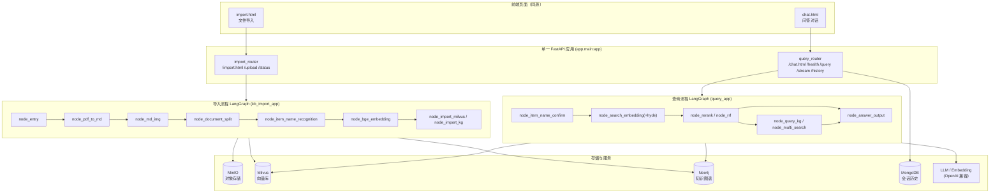

# 掌柜智库（Zhanggui Zhiku）

一个基于 **LangGraph + FastAPI** 的 RAG 知识库项目：**PDF/Markdown 导入 → 解析/切分/向量化/入库（Milvus + Neo4j）**，并提供**多路检索 + 重排 + 融合 + 知识图谱 + LLM 问答**的一体化服务。

> 本项目是一个**生产级、可运行**的单应用 RAG 系统：统一配置入口、单一 FastAPI 应用、清晰的分层目录，核心业务逻辑（agent 节点、clients、lm、utils 核心算法）作为系统实现保留。

---

## 1. 架构总览



更详细的设计、类图与时序图见 [`docs/`](./docs)：
- [`docs/architecture-design.md`](./docs/architecture-design.md)
- [`docs/class-diagram.mermaid`](./docs/class-diagram.mermaid)
- [`docs/sequence-diagram.mermaid`](./docs/sequence-diagram.mermaid)

---

## 2. 技术栈

| 层 | 技术 |
| --- | --- |
| Web 框架 | FastAPI + Uvicorn |
| 工作流编排 | LangGraph（StateGraph） |
| LLM / Embedding | OpenAI 兼容 API（千问 / 即梦等），BGE-M3 向量模型，BGE-Reranker |
| 向量库 | Milvus（稠密 + 稀疏混合检索） |
| 知识图谱 | Neo4j |
| 对象存储 | MinIO（PDF / 图片持久化） |
| 会话历史 | MongoDB（PyMongo） |
| 文档解析 | MinerU（`magic-pdf`） |
| 配置 | `python-dotenv` + dataclass 单例（零额外依赖，无 pydantic-settings） |
| 日志 | Loguru |
| 部署 | Docker / docker-compose |

---

## 3. 快速开始

### 3.1 环境要求

- Python >= 3.11
- 建议：Linux / macOS（Windows 亦可，路径已做兼容）

### 3.2 安装依赖

使用 [`uv`](https://github.com/astral-sh/uv)（推荐，已提供 `uv.lock` 锁定 171 个包版本，可精确复现）：

```bash
uv sync                 # 按 uv.lock 创建 .venv 并安装全部依赖（含 torch/langchain/magic-pdf 等）
```

> `uv sync` 会自动读取仓库根目录的 `uv.lock` 还原依赖树；首次运行会自动创建虚拟环境。若只需重装可省去 lock：`uv pip install -e .`。

或使用 pip：

```bash
python -m venv .venv
source .venv/bin/activate        # Windows: .venv\Scripts\activate
pip install -e .
```

> 依赖较重（含 `torch`、`langchain`、`magic-pdf` 等）。若仅需运行服务骨架，可临时裁剪 `requirements.txt` / `pyproject.toml` 中的重型包。

### 3.3 配置环境变量

```bash
cp .env.example .env
# 编辑 .env，填写 OPENAI_API_KEY / MINERU_API_TOKEN 等
```

所有配置字段见 [§5 环境变量](#5-环境变量一览)。

### 3.4 启动服务

方式一：命令行入口（由 `pyproject.toml` 的 `scripts` 提供）

```bash
zhanggui-zhiku            # 等价于 uvicorn app.main:app --host 0.0.0.0 --port 8000
```

方式二：直接用 uvicorn

```bash
uvicorn app.main:app --host 0.0.0.0 --port 8000
```

启动后访问：
- 导入页：<http://localhost:8000/import.html>
- 问答页：<http://localhost:8000/chat.html>
- API 文档：<http://localhost:8000/docs>

---

## 4. Docker 部署

默认 `Dockerfile` 按 `requirements` **全量安装**（含 `torch` / `langchain` / `magic-pdf`，镜像较大但开箱即用）。如需更小体积，可改用 CPU-only 依赖或按下方「CPU slim」裁剪。

```bash
# 1) 准备 .env（参考 .env.example，容器网络内地址由 compose 自动覆盖为服务名）
cp .env.example .env

# 2) 启动全部依赖（web / milvus / mongo / minio / minio-init / neo4j）；首次需 --build 构建 web 镜像
docker compose up -d --build

# 3) 访问
#    导入页：http://localhost:8000/import.html
#    问答页：http://localhost:8000/chat.html
#    MinIO 控制台：http://localhost:9001 （账号见 .env: MINIO_ACCESS_KEY/SECRET_KEY）
#    Neo4j 浏览器：http://localhost:7474
```

> **CPU slim 提示**：在 `requirements.txt` / `pyproject.toml` 中将 `torch` / `torchvision` / `torchaudio` 替换为 CPU 版本（如 `torch==2.*+cpu`，并配置对应 index-url），可显著减小镜像体积；同时 `BGE_DEVICE=cpu`、`BGE_RERANKER_DEVICE=cpu`。

> **MinIO 桶**：`docker compose up` 时 `minio-init` 服务会自动创建 `.env` 中 `MINIO_BUCKET_NAME`（默认 `kb-import-bucket`）桶，无需手动操作；若单独启动容器未运行 `minio-init`，上传会给出友好提示。

---

## 5. 环境变量一览

| 分组 | 变量 | 默认值 | 说明 |
| --- | --- | --- | --- |
| 应用 | `APP_HOST` / `APP_PORT` | `0.0.0.0` / `8000` | 服务监听地址与端口 |
| 应用 | `PROJECT_ROOT` | 仓库根 | 留空自动推导；特殊部署可显式指定 |
| 应用 | `CORS_ORIGINS` | `http://localhost:8000` | 逗号分隔的允许来源 |
| 应用 | `CORS_ALLOW_CREDENTIALS` | `True` | 是否允许携带凭据 |
| 模型 | `MODELS_DIR` | `./models` | 模型与缓存根目录 |
| 模型 | `MODELSCOPE_CACHE` / `HF_HOME` / `BGE_M3_PATH` / `BGE_RERANKER_LARGE` | 由 `MODELS_DIR` 推导 | 留空则自动推导 |
| 模型 | `MD_ROOT_DIR` | `./temp-files` | MinerU 中间产物目录 |
| LLM | `OPENAI_BASE_URL` | 空 | OpenAI 兼容 API 地址 |
| LLM | `OPENAI_API_KEY` | `your-key-here` | **必填**（生产请替换为真实密钥） |
| LLM | `VL_MODEL` / `LLM_DEFAULT_MODEL` | 空 | 多模态 / 默认对话模型名 |
| LLM | `LLM_DEFAULT_TEMPERATURE` | `0.7` | 默认温度 |
| Embedding | `BGE_M3` / `BGE_DEVICE` / `BGE_FP16` | `BAAI/bge-m3` / `cpu` / `0` | BGE-M3 配置 |
| Milvus | `MILVUS_URL` | `http://localhost:19530` | 向量库地址 |
| Milvus | `CHUNKS_COLLECTION` / `ENTITY_NAME_COLLECTION` / `ITEM_NAME_COLLECTION` | `kb_chunks` / `kb_entity_names` / `kb_item_names` | 集合名 |
| Milvus | `EMBEDDING_DIM` | `1024` | 向量维度 |
| Neo4j | `NEO4J_URI` / `NEO4J_DATABASE` / `NEO4J_USERNAME` / `NEO4J_PASSWORD` | `bolt://localhost:7687` / `neo4j` / `neo4j` / `neo4j123456` | 图谱连接 |
| Mongo | `MONGO_URL` / `MONGO_DB_NAME` | `mongodb://localhost:27017` / `zhanggui-zhiku` | 会话历史库 |
| MinIO | `MINIO_ENDPOINT` / `MINIO_ACCESS_KEY` / `MINIO_SECRET_KEY` | `localhost:9000` / `minioadmin` / `minioadmin` | 对象存储 |
| MinIO | `MINIO_BUCKET_NAME` / `MINIO_IMG_DIR` / `MINIO_PDF_DIR` / `MINIO_SECURE` | `kb-import-bucket` / `images` / `pdf_files` / `False` | 桶与目录 |
| Reranker | `BGE_RERANKER_DEVICE` / `BGE_RERANKER_FP16` | `cpu` / `0` | 重排模型配置 |
| MCP/MinerU | `MCP_DASHSCOPE_BASE_URL` / `MINERU_BASE_URL` / `MINERU_API_TOKEN` | 空 / 空 / `your-key-here` | 外部服务配置 |
| 日志 | `LOG_CONSOLE_ENABLE` / `LOG_FILE_ENABLE` / `LOG_CONSOLE_LEVEL` / `LOG_FILE_LEVEL` / `LOG_FILE_RETENTION` | `True` / `True` / `INFO` / `INFO` / `7 days` | 日志输出与保留 |

> **安全性**：`.env` 已被 `.gitignore` 忽略，**切勿提交真实密钥或内网地址**。仓库仅保留 `.env.example`（全部为 localhost / 占位值）。

---

## 6. API 参考（共 9 个端点）

### 导入服务（`import_router`）

| 方法 | 路径 | 说明 |
| --- | --- | --- |
| GET | `/import.html` | 返回文件导入前端页面 |
| POST | `/upload` | 多文件上传（form-data `files`），触发后台导入流程，返回 `task_ids` |
| GET | `/status/{task_id}` | 查询单个导入任务的进度与状态（`pending/processing/completed/failed`） |

### 查询服务（`query_router`）

| 方法 | 路径 | 说明 |
| --- | --- | --- |
| GET | `/chat.html` | 返回问答前端页面 |
| GET | `/health` | 健康检查，返回 `{"ok": true}` |
| POST | `/query` | 提交提问；`is_stream=true` 时进入 SSE 流式模式，返回 `session_id` |
| GET | `/stream/{session_id}` | SSE 流式推送检索/生成进度与最终答案 |
| GET | `/history/{session_id}` | 查询指定会话的历史消息（`limit` 参数可选，默认 50） |
| DELETE | `/history/{session_id}` | 清空指定会话的历史消息 |

`/query` 请求体示例：

```json
{
  "query": "这个万用表怎么换电池？",
  "session_id": "可选，不传则自动生成",
  "is_stream": true
}
```

---

## 7. 目录结构

```
zhanggui-zhiku/
├── app/                      # 应用源码
│   ├── main.py               # 统一入口：create_app() + run()
│   ├── api/                  # 路由层
│   │   ├── import_router.py  # 文件导入路由
│   │   └── query_router.py   # 查询路由
│   ├── core/                 # 核心：config / logger / load_prompt
│   │   ├── config.py         # 唯一一次 load_dotenv + Settings 单例
│   │   └── logger.py
│   ├── conf/                 # 各组件配置（消费 settings）
│   ├── clients/              # MinIO / Milvus / MongoDB 客户端封装
│   ├── lm/                   # LLM / Embedding 工具
│   ├── utils/                # 路径 / 任务态 / SSE 工具
│   ├── import_process/       # 导入流程（agent + nodes + page）
│   ├── query_process/        # 查询流程（agent + nodes + page）
│   └── tool/                 # 模型下载脚本
├── prompts/                  # Prompt 模板（.prompt）
├── test/                     # 手动测试脚本（需完整依赖，手动运行）
├── docs/                     # 架构设计 / 类图 / 时序图
├── pyproject.toml            # 项目元数据 + 依赖 + 命令行入口
├── requirements.txt          # 运行依赖清单
├── Dockerfile
├── docker-compose.yml
├── .dockerignore
├── .env.example
├── .gitignore
└── README.md
```

---

## 8. 测试

`test/` 下的脚本**需要完整依赖、且依赖本地服务（Milvus/Mongo/MinIO/Neo4j 等）**，因此：

- **不在 CI / 自动化测试中执行**；
- 文件头部已标注「需完整依赖，手动运行」；
- 请在本地环境就绪后手动运行，例如：

```bash
python test/01-env和系统环境变量的优先级.py
python test/04-test_graph_flow.py
```

自动化单测（如有）建议放在独立的 `tests/` 包中，仅覆盖纯函数/无外部依赖的逻辑。

---

## 9. 常见问题（Troubleshooting）

- **启动报 `ModuleNotFoundError`**：确认已 `pip install -e .` 且 Python >= 3.11；重型包（torch 等）需联网安装。
- **`.env` 未生效**：`.env` 由 `app.core.config` 在导入时**仅加载一次**，请确保在启动进程前已存在；`PROJECT_ROOT` 等也可通过环境变量覆盖。
- **MinIO 上传失败**：检查 `.env` 中 `MINIO_ENDPOINT` / `MINIO_ACCESS_KEY` / `MINIO_SECRET_KEY`；桶 `MINIO_BUCKET_NAME` 默认由 `minio-init` 自动创建，若未跑该服务请手动在 MinIO 控制台建桶。上传失败不阻断本地处理流程（仅记录警告）。
- **Milvus 连接失败**：确认 `MILVUS_URL` 可达（本地 `http://localhost:19530`，容器网络内为 `http://milvus:19530`）。
- **页面 API 跨域**：前端 `API_BASE` 已统一为 `window.location.origin`（同源）；如需跨域，调整 `CORS_ORIGINS`。
- **容器内外地址不一致**：`docker-compose.yml` 已通过 `environment` 将关键地址覆盖为服务名（`milvus`/`mongo`/`minio`/`neo4j`），无需修改 `.env`。

---

## 10. 生产化改造（v1.1.0）

> 本仓库按**生产标准**做了 M1~M8 工程化改造（方案见
> `pending/zhanggui-zhiku-production-plan.md`），主线：CI / 版本治理 / 评测 / 索引版本化 /
> 配置外置 / OTel 全链路 / 入站安全护栏 / 并发与水平扩展 / 压测闭环 / 硅基流动 API 模式（无 GPU 运行）。

### 10.1 M1~M8 一句话总览

| 里程碑 | 内容 | 关键产出 |
|---|---|---|
| M1 工程闭环 | CI（uv 锁依赖 + ruff + 分级测试）、版本治理、测试目录归并 | `.github/workflows/zhiku-ci.yml`、`CHANGELOG.md` |
| M2 评测 + 索引版本化 | golden 集 + Recall/MRR/nDCG 评测管线；集合版本化 + chunk 元数据 + registry | `eval/`、`data/index_registry.json` |
| M3 配置外置 | 检索/重排参数外置 yaml + config_hash 实验追踪 | `app/conf/retrieval.yaml`、`rerank.yaml` |
| M3.5 TopK 消融 | 固定 k vs 动态断崖对比实验框架（实测后回填） | `eval/topk_ablation.md` |
| M4 OTel 全链路 | 9 类 span + no-op 降级铁律 + X-Trace-Id | `app/core/tracing.py` |
| M5 入站安全护栏 | API Key 鉴权 + 入站限流 + 长度护栏 + 错误脱敏 | `app/api/middleware/security_guards.py` |
| M6 部署 + 水平扩展 | 逐路超时隔离 + reranker Semaphore + compose profile + 探针 | `app/query_process/agent/fanout.py`、`docker-compose.yml` |
| M7 压测容量闭环 | 压测 SOP + 容量模型 + 验收清单（实测后回填） | `benchmark/`、`docs/verification-checklist.md` |
| M8 硅基流动 API 模式 | embedding/rerank 双模式（local 默认，api 可选），无 GPU / 无本地模型也能完整跑通 | `app/lm/siliconflow_client.py`、`app/lm/sparse_vectorizer.py` |

### 10.2 关键文件索引

- CI / Nightly：`.github/workflows/zhiku-ci.yml`、`zhiku-nightly.yml`（monorepo 根）
- 评测：`eval/run_eval.py`、`eval/run_ablation.py`、`eval/metrics.py`
- 索引版本化：`app/conf/milvus_config.py`、`app/utils/index_registry.py`、`data/index_registry.json`
- 配置外置：`app/conf/retrieval.yaml`、`app/conf/rerank.yaml`、`app/conf/yaml_config_utils.py`
- 可观测：`app/core/tracing.py`（M4）
- 安全护栏：`app/api/middleware/security_guards.py`、`app/api/errors.py`（M5）
- 并发与扩展：`app/query_process/agent/fanout.py`、`app/utils/rerank_concurrency.py`（M6）
- 压测：`benchmark/locustfile.py`、`benchmark/README.md`、`benchmark/CAPACITY.md`（M6/M7）
- 环境验收：`docs/verification-checklist.md`（M7）
- 硅基流动 API 模式：`app/lm/siliconflow_client.py`、`app/lm/sparse_vectorizer.py`、
  `app/lm/embedding_utils.py`、`app/lm/reranker_utils.py`（M8）

### 10.3 运行方式（M6 起）

```bash
# 默认栈（基础设施 core profile + web；可观测 obs 按需追加）
docker compose --profile core up -d --build

# 链路追踪（可选）：.env 配 OTEL_EXPORTER_OTLP_ENDPOINT=http://jaeger:4317 + ZHANGUI_TRACE_ENABLED=true
docker compose --profile core --profile obs up -d --build

# 启用入站鉴权（可选）：.env 设 ZHANGUI_API_KEY，请求带 X-API-Key 或 Authorization: Bearer
```

> 注意：因 Compose profile 语义，`docker compose up -d`（不带 `--profile core`）会报
> `service milvus is required by web but is disabled`，请始终带 `--profile core`。

### 10.4 诚实边界

- 真实评测 / 压测数字**待环境就绪后实测**：`eval/` 指标、`benchmark/` 结果表、
  `data/index_registry.json` 的 eval 字段均为空模板 / null，**禁止预填**（方案 §13）。
- `eval/golden_queries.jsonl` 为**构造 / 脱敏标注**，`doc/` 真实素材已就位但环境未就绪未入库，
  待真实文档入库后需按实际 chunk_id 重新标注。
- 检索链路为同步 LangGraph invoke + 线程级超时隔离（M6 技术债：同步代码不可中断，
  由下游超时兜底）；入站限流为进程内实现，多副本需外置 Redis（M5 技术债）。
- **KG 图谱检索通道（`node_query_kg.py`）为占位 stub（仅 `time.sleep(1)`，未接 Neo4j）**：
  fan-out 超时降级框架（guarded_call / wrap_channel_node / retrieval.yaml timeout_s）代码已就位，
  但 kg 通道真实故障隔离能力**未接入、未验证**（详见 docs/verification-checklist.md ⑥ 与
  docs/ops-lessons-learned.md §4.1），接入真实 Neo4j 前不得声称该项已验证。
- 端到端 `/query` QPS 受外部 LLM API 限流约束，**不承诺 100 QPS**（分档压测口径见 benchmark/）。

### 10.5 硅基流动 API 模式（M8，无 GPU 运行）

无 GPU / 未安装本地模型（FlagEmbedding、pymilvus.model）时，可把 embedding / rerank 切换到
硅基流动（SiliconFlow）OpenAI 兼容 API，**无需本地模型即可完整跑通导入与检索**。

**启用方法**（`.env`，全部可用环境变量覆盖）：

```bash
EMBEDDING_MODE=api
RERANK_MODE=api
SILICONFLOW_API_KEY=sk-xxx            # 必填（api 模式），硅基流动控制台获取
# 以下为可选覆盖默认值：
SILICONFLOW_BASE_URL=https://api.siliconflow.cn/v1
SILICONFLOW_EMBEDDING_MODEL=BAAI/bge-m3
SILICONFLOW_RERANK_MODEL=BAAI/bge-reranker-v2-m3
```

也可以只开一路（如 `EMBEDDING_MODE=api` + `RERANK_MODE=local`）。默认均为 `local`，
**不改配置时行为与 M7 及之前完全一致**（本地 BGE-M3 稠密+稀疏双路 + FlagReranker）。

**与 local 模式的差异**：

| 维度 | local（默认） | api（M8） |
|---|---|---|
| 模型文件 | BGE-M3 + Reranker 本地权重（需下载/挂载） | 无（调用远端 API） |
| GPU / 显存 | 可选（CPU 可跑，但更慢） | 不需要 |
| 网络 | 无 | 需外网访问 `api.siliconflow.cn` |
| 稠密向量 | BGE-M3 本地推理（原生 L2 归一化） | API 返回 1024 维向量 + **本地 L2 归一化**（语义对齐） |
| 稀疏向量 | BGE-M3 原生 SPLADE | **本地词权重近似**（见下方诚实说明） |
| rerank | FlagReranker 本地推理 | API `/rerank`（`relevance_score` 0~1） |

**稀疏向量 B 路线（重点说明）**：硅基流动 embeddings API **不返回稀疏向量**，为保住
Milvus 稠密+稀疏双路混合检索，api 模式由 `app/lm/sparse_vectorizer.py` **本地生成**稀疏向量：
中文重叠 bigram + 短整词、英文/数字词元、词频（TF）权重、L2 归一化；token→id 用
`hashlib.md5` 稳定映射（跨进程一致，**非**内置 `hash()`）。导入与检索共用同一实现，保证
doc/query token 空间一致。**诚实说明：这是对 BGE-M3 原生 SPLADE 的近似（本地 BM25 风格词权重），
非模型原生稀疏，检索效果可能与 local 模式存在差异**（尤其语义型关键词召回）；如对稀疏路
效果敏感，建议仍用 local 模式或用评测管线对比。

**批量策略**：上游 `node_bge_embedding` 仍按 5 条/批喂入；api 端 embedding 单批 16 条、
rerank 单 query 单批 64 条 documents 一次调用（减少 API 往返）。超时 30s、429/5xx/网络异常
简单重试 2 次（退避 0.5s 起），**无熔断**（技术债见 CHANGELOG M8）。

---

## 11. License

[MIT](https://opensource.org/licenses/MIT)
