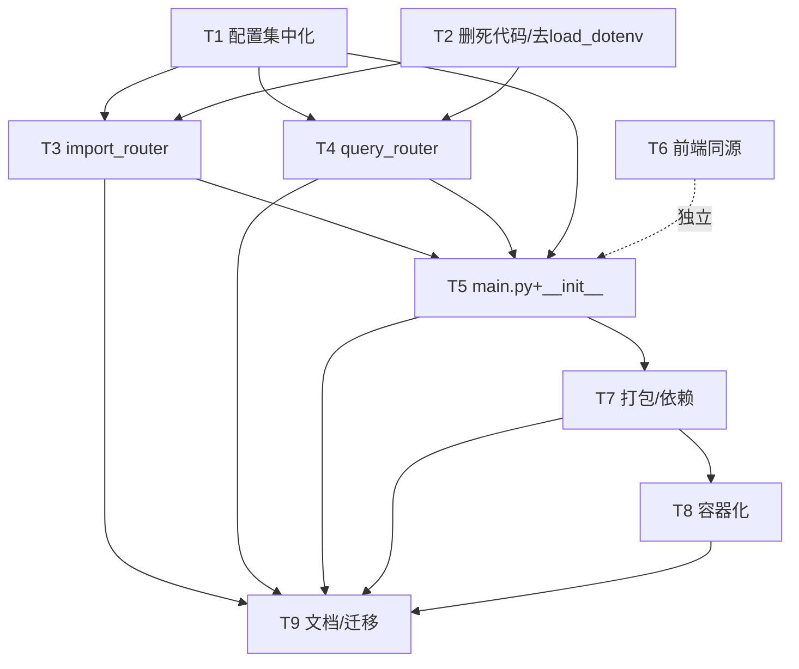

# 掌柜智库（zhanggui-zhiku）生产级重构 — 架构设计与任务分解

> 作者：高见远（软件架构师） ｜ 交付总监：齐活林
> 目标：将项目整理为 **单一 FastAPI 应用 + 配置全外置 + 工程化补齐（打包/容器/文档）**，**不重写业务逻辑**，只做结构整理、配置外置、入口合并、工程化补齐。

---

## 0. 源项目关键事实（已核对）

| 项 | 结论 |
|---|---|
| 源位置 | `D:\BaiduNetdiskDownload\...PythonProject16` |
| 已有 `main.py` / `Dockerfile` / `docker-compose.yml` / `requirements.txt` / `.gitignore` / `.env.example` | **均无**（需新建） |
| `app/__init__.py`、`app/core/__init__.py`、`app/import_process/__init__.py`、`app/import_process/agent/nodes/__init__.py`、`app/query_process/api/__init__.py`、`app/query_process/agent/nodes/__init__.py`、`app/api/__init__.py` | **缺失**（需补，否则 `packages.find` 会漏包） |
| 散落的 `load_dotenv()` | **17 处**（见 §4 清单），需收敛到 `app/core/config.py` 单点 |
| `mongo_history_utils_new.py` | **全仓零引用**（grep 确认），可安全删除 |
| 前端写死地址 | `import.html`:`http://127.0.0.1:8000`；`chat.html`: 兜底 `http://127.0.0.1:8001` |
| `.env` 中真实密钥 | `OPENAI_API_KEY`、`MINERU_API_TOKEN`、`NEO4J_PASSWORD`、`MINIO_SECRET_KEY` 等，**绝不进仓库** |
| `.env` 中硬编码绝对路径 | `D:/ai_models/modelscope_cache`、`D:/ai_models/huggingface_cache`、`MD_ROOT_DIR=./temp-files/` |
| `.env` 中远程地址 | `MILVUS_URL=http://47.94.86.115:19530`、`MONGO_URL=mongodb://47.94.86.115:27017`、`NEO4J_URI=bolt://192.168.11.104:7687`、`MINIO_ENDPOINT=47.94.86.115:9000` |
| 两个服务端口 | import 服务 `127.0.0.1:8000`，query 服务 `127.0.0.1:8001`（合并后统一 `APP_PORT` 默认 8000） |
| `MINIO_PDF_DIR` / `ENTITY_NAME_COLLECTION` | 代码使用但 `.env` 未提供 → 在 config 中补默认值 |

---

## 1. 目标文件树

```
zhanggui-zhiku/
├── .env.example              # 【新】占位配置（纯说明，无真实值）
├── .gitignore                # 【新】排除 .env/output/logs/models/__pycache__
├── .dockerignore             # 【新】构建上下文忽略
├── Dockerfile                # 【新】python:3.11-slim 镜像
├── docker-compose.yml        # 【新】milvus / mongo / minio / neo4j / 本服务
├── README.md                 # 【新】架构图+快速开始+API 速查+故障排查
├── pyproject.toml            # 【改】规范化元数据 + [tool.setuptools.packages.find] + [project.scripts]
├── requirements.txt          # 【新】pip 等价依赖（可由 uv export 生成）
├── app/
│   ├── __init__.py           # 【补】缺失包标记
│   ├── main.py               # 【新】单一 FastAPI 入口：建 app、CORS、include_router、run()
│   ├── core/
│   │   ├── __init__.py       # 【补】
│   │   ├── config.py         # 【新】集中配置（dataclass + 单点 load_dotenv），全仓唯一 env 读取入口
│   │   ├── logger.py         # 【改】去掉 load_dotenv，PROJECT_ROOT 改从 config 取
│   │   └── load_prompt.py    # 【迁】不变
│   ├── conf/                 # 【改】7 个文件全部去除 load_dotenv，改 from app.core.config import settings
│   │   ├── embedding_config.py
│   │   ├── lm_config.py
│   │   ├── milvus_config.py
│   │   ├── minio_config.py
│   │   ├── mineru_config.py
│   │   ├── reranker_config.py
│   │   └── bailian_mcp_config.py
│   ├── clients/
│   │   ├── milvus_utils.py
│   │   ├── minio_utils.py
│   │   ├── mongo_history_utils.py   # 【改】去 load_dotenv
│   │   ├── neo4j_utils.py
│   │   └── (mongo_history_utils_new.py)  # 【删】死代码
│   ├── utils/
│   │   ├── path_util.py      # 【改】去 load_dotenv，PROJECT_ROOT 改从 config 取（保留 get_path_dir 助手）
│   │   ├── escape_milvus_string_utils.py
│   │   ├── format_utils.py
│   │   ├── normalize_sparse_vector.py
│   │   ├── rate_limit_utils.py
│   │   ├── sse_utils.py
│   │   └── task_utils.py
│   ├── lm/
│   │   ├── embedding_utils.py
│   │   ├── lm_utils.py       # 【改】去 load_dotenv
│   │   └── reranker_utils.py
│   ├── import_process/
│   │   ├── agent/            # 【迁】state/main_graph/nodes；去散落 load_dotenv
│   │   │   ├── state.py
│   │   │   ├── main_graph.py     # 【改】去 load_dotenv
│   │   │   └── nodes/            # 【改】node_import_milvus 等去 load_dotenv；补 __init__.py
│   │   ├── api/
│   │   │   ├── import_router.py  # 【新】由 file_import_service.py 改造为 APIRouter
│   │   │   └── __init__.py       # 【补】
│   │   └── page/
│   │       └── import.html   # 【改】API_BASE = window.location.origin
│   ├── query_process/
│   │   ├── agent/            # 【迁】去散落 load_dotenv；补 nodes/__init__.py
│   │   │   ├── state.py
│   │   │   ├── main_graph.py     # 【改】去 load_dotenv
│   │   │   └── nodes/            # 【改】node_item_name_confirm / node_search_embedding / node_search_embedding_hyde 去 load_dotenv
│   │   ├── api/
│   │   │   ├── query_router.py   # 【新】由 query_service.py 改造为 APIRouter
│   │   │   └── __init__.py       # 【补】
│   │   └── page/
│   │       └── chat.html     # 【改】API_BASE = window.location.origin
│   └── tool/                 # 【迁】模型下载脚本保留
│       ├── download_bgem3.py
│       └── download_reranker.py
├── prompts/                  # 【迁】6 个 .prompt 模板（原样保留）
├── test/                     # 【迁】开发自测脚本（标注需完整依赖环境）
├── output/                   # 运行时产物（gitignore，不纳入）
├── logs/                     # 运行时日志（gitignore）
└── models/                   # 模型缓存（gitignore）
```

> `doc/`（700MB+ 测试 PDF）**不纳入**。

---

## 2. 配置外置方案

### 2.1 设计原则
- **单点读取**：新建 `app/core/config.py`，在模块导入时 **唯一一次** `load_dotenv()`，用 `dataclass` 定义 `Settings`，全部 `os.getenv(...)` 带默认值；导出模块级单例 `settings = Settings()`。
- **零新增依赖**：沿用现有 `python-dotenv`（已在依赖中），**不引入** `pydantic-settings`（除非团队确认需要，见 §6）。
- **派生默认值**：`MODELSCOPE_CACHE` / `HF_HOME` 默认基于 `MODELS_DIR` 派生，避免再出现 `D:/ai_models/...` 硬编码；同时允许独立覆盖。
- **确定性 PROJECT_ROOT**：`config.py` 中 `PROJECT_ROOT = Path(__file__).resolve().parents[2]`（app/core → 上两级 = 仓库根），并允许 `PROJECT_ROOT` 环境变量覆盖。Docker 下无 `.env` 文件也能正确定位，解决原 `path_util.get_project_root()` 依赖 `.env` 存在的隐患。

### 2.2 `config.py` 字段设计（属性名 → env key → 默认值 → 说明）

> 类型说明：`list` = 逗号分隔解析；`bool` = `"True"/"1"` → True。

| 分组 | Python 属性 | env key | 默认值 | 说明 |
|---|---|---|---|---|
| 应用 | `app_host` | `APP_HOST` | `0.0.0.0` | 监听地址 |
| 应用 | `app_port` | `APP_PORT` | `8000` | 监听端口（原 8000/8001 合并为单端口） |
| 应用 | `project_root` | `PROJECT_ROOT` | `Path(__file__).resolve().parents[2]` | 仓库根，可覆盖 |
| 应用 | `cors_origins` | `CORS_ORIGINS` | `http://localhost:8000` | 逗号分隔，默认同源域名（**不给 `*`**） |
| 应用 | `cors_allow_credentials` | `CORS_ALLOW_CREDENTIALS` | `True` | 是否允许凭证 |
| 模型 | `models_dir` | `MODELS_DIR` | `./models` | 模型根目录（替代 `D:/ai_models`） |
| 模型 | `modelscope_cache` | `MODELSCOPE_CACHE` | `{models_dir}/modelscope_cache` | 可被独立覆盖 |
| 模型 | `hf_home` | `HF_HOME` | `{models_dir}/huggingface_cache` | 可被独立覆盖 |
| 模型 | `md_root_dir` | `MD_ROOT_DIR` | `./temp-files` | Mineru 临时目录 |
| 模型 | `mineru_model_source` | `MINERU_MODEL_SOURCE` | `modelscope` | 模型来源 |
| 模型 | `modelscope_offline` | `MODELSCOPE_OFFLINE` | `False` | 是否离线模式 |
| LLM | `openai_base_url` | `OPENAI_BASE_URL` | `https://dashscope.aliyuncs.com/compatible-mode/v1` | 兼容端点 |
| LLM | `openai_api_key` | `OPENAI_API_KEY` | `""` | **密钥** |
| LLM | `vl_model` | `VL_MODEL` | `qwen-vl-max` | 视觉模型 |
| LLM | `llm_default_model` | `LLM_DEFAULT_MODEL` | `qwen-plus` | 默认文本模型 |
| LLM | `llm_default_temperature` | `LLM_DEFAULT_TEMPERATURE` | `0.7` | 温度 |
| LLM | `item_name_diag` | `ITEM_NAME_DIAG` | `""` | 项目名识别诊断开关 |
| Embedding | `bge_m3_path` | `BGE_M3_PATH` | `{models_dir}/bge-m3` | 本地模型路径 |
| Embedding | `bge_m3` | `BGE_M3` | `BAAI/bge-m3` | 模型仓库标识 |
| Embedding | `bge_device` | `BGE_DEVICE` | `cpu` | 设备 |
| Embedding | `bge_fp16` | `BGE_FP16` | `False` | 半精度 |
| Milvus | `milvus_url` | `MILVUS_URL` | `http://localhost:19530` | 连接地址 |
| Milvus | `chunks_collection` | `CHUNKS_COLLECTION` | `kb_chunks` | 切片集合 |
| Milvus | `entity_name_collection` | `ENTITY_NAME_COLLECTION` | `kb_entity_names` | 实体集合（原 .env 未给，补默认） |
| Milvus | `item_name_collection` | `ITEM_NAME_COLLECTION` | `kb_item_names` | 项目名集合 |
| Milvus | `embedding_dim` | `EMBEDDING_DIM` | `1024` | 向量维度 |
| Neo4j | `neo4j_uri` | `NEO4J_URI` | `bolt://localhost:7687` | 连接地址 |
| Neo4j | `neo4j_database` | `NEO4J_DATABASE` | `neo4j` | 库名 |
| Neo4j | `neo4j_username` | `NEO4J_USERNAME` | `neo4j` | 用户名 |
| Neo4j | `neo4j_password` | `NEO4J_PASSWORD` | `neo4j123456` | **密钥** |
| Mongo | `mongo_url` | `MONGO_URL` | `mongodb://localhost:27017` | 连接串 |
| Mongo | `mongo_db_name` | `MONGO_DB_NAME` | `zhanggui_zhiku` | 库名 |
| MinIO | `minio_endpoint` | `MINIO_ENDPOINT` | `localhost:9000` | 端点 |
| MinIO | `minio_access_key` | `MINIO_ACCESS_KEY` | `minioadmin` | **密钥** |
| MinIO | `minio_secret_key` | `MINIO_SECRET_KEY` | `minioadmin` | **密钥** |
| MinIO | `minio_bucket_name` | `MINIO_BUCKET_NAME` | `kb-import-bucket` | 桶名 |
| MinIO | `minio_img_dir` | `MINIO_IMG_DIR` | `images` | 图片目录 |
| MinIO | `minio_secure` | `MINIO_SECURE` | `False` | 是否 https |
| MinIO | `minio_pdf_dir` | `MINIO_PDF_DIR` | `pdf_files` | PDF 目录（原代码用，补默认） |
| Reranker | `bge_reranker_large` | `BGE_RERANKER_LARGE` | `{models_dir}/bge-reranker-v2-m3` | 本地路径 |
| Reranker | `bge_reranker_device` | `BGE_RERANKER_DEVICE` | `cpu` | 设备 |
| Reranker | `bge_reranker_fp16` | `BGE_RERANKER_FP16` | `False` | 半精度 |
| MCP | `mcp_dashscope_base_url` | `MCP_DASHSCOPE_BASE_URL` | `""` | 百炼 MCP 基址 |
| Mineru | `mineru_base_url` | `MINERU_BASE_URL` | `""` | API 基址 |
| Mineru | `mineru_api_token` | `MINERU_API_TOKEN` | `""` | **密钥** |
| 日志 | `log_console_enable` | `LOG_CONSOLE_ENABLE` | `True` | 控制台输出 |
| 日志 | `log_console_level` | `LOG_CONSOLE_LEVEL` | `INFO` | 控制台级别 |
| 日志 | `log_file_enable` | `LOG_FILE_ENABLE` | `True` | 文件输出 |
| 日志 | `log_file_level` | `LOG_FILE_LEVEL` | `INFO` | 文件级别 |
| 日志 | `log_file_retention` | `LOG_FILE_RETENTION` | `7 days` | 保留期 |

### 2.3 `config.py` 结构示意（仅骨架，非业务代码）

```python
# app/core/config.py
from dataclasses import dataclass, field
from pathlib import Path
import os
from dotenv import load_dotenv

load_dotenv()  # 全仓唯一一次

ROOT = Path(__file__).resolve().parents[2]
MODELS_DIR = os.getenv("MODELS_DIR", "./models")

@dataclass(frozen=True)
class Settings:
    # 应用
    app_host: str = os.getenv("APP_HOST", "0.0.0.0")
    app_port: int = int(os.getenv("APP_PORT", "8000"))
    project_root: Path = Path(os.getenv("PROJECT_ROOT", str(ROOT)))
    cors_origins: list = field(
        default_factory=lambda: [s.strip() for s in os.getenv("CORS_ORIGINS", "http://localhost:8000").split(",") if s.strip()]
    )
    cors_allow_credentials: bool = os.getenv("CORS_ALLOW_CREDENTIALS", "True").lower() == "true"
    # 模型
    models_dir: str = MODELS_DIR
    modelscope_cache: str = os.getenv("MODELSCOPE_CACHE", f"{MODELS_DIR}/modelscope_cache")
    hf_home: str = os.getenv("HF_HOME", f"{MODELS_DIR}/huggingface_cache")
    # ... 其余字段按 2.2 表一一对应 ...

settings = Settings()
```

各 `conf/*.py` 改为：删除 `from dotenv import load_dotenv` 与 `load_dotenv()`，删除本地 `os.getenv(...)`；改为 `from app.core.config import settings`，并 `milvus_config = MilvusConfig(milvus_url=settings.milvus_url, ...)`。

---

## 3. 服务合并方案

### 3.1 端点清单（合并后全部保留，路径不变）

| 方法 | 路径 | 原属服务 | 归属 router | 说明 |
|---|---|---|---|---|
| GET | `/import.html` | import (8000) | `import_router` | 返回导入页 |
| POST | `/upload` | import (8000) | `import_router` | 多文件上传，触发后台 LangGraph |
| GET | `/status/{task_id}` | import (8000) | `import_router` | 任务进度轮询 |
| GET | `/chat.html` | query (8001) | `query_router` | 返回对话页 |
| GET | `/health` | query (8001) | `query_router` | 健康检查 |
| POST | `/query` | query (8001) | `query_router` | 提问（同步/流式） |
| GET | `/stream/{session_id}` | query (8001) | `query_router` | SSE 流式输出 |
| GET | `/history/{session_id}` | query (8001) | `query_router` | 历史查询 |
| DELETE | `/history/{session_id}` | query (8001) | `query_router` | 历史删除 |

> 共 **9 个端点**，全部保留；端口统一为 `APP_PORT`（默认 8000）。

### 3.2 `main.py` 组装示意（仅骨架）

```python
# app/main.py
from fastapi import FastAPI
from fastapi.middleware.cors import CORSMiddleware
from app.core.config import settings
from app.api.import_router import router as import_router
from app.api.query_router import router as query_router

def create_app() -> FastAPI:
    app = FastAPI(title="掌柜智库 (ZhangGui ZhiKu)", description="RAG 知识库导入与问答统一服务")
    app.add_middleware(
        CORSMiddleware,
        allow_origins=settings.cors_origins,          # 可配，默认不含 "*"
        allow_credentials=settings.cors_allow_credentials,
        allow_methods=["*"],
        allow_headers=["*"],
    )
    app.include_router(import_router)
    app.include_router(query_router)
    return app

app = create_app()

def run():
    import uvicorn
    uvicorn.run("app.main:app", host=settings.app_host, port=settings.app_port)

if __name__ == "__main__":
    run()
```

### 3.3 router 改造要点
- `file_import_service.py` → `app/api/import_router.py`：`app = FastAPI(...)` 改为 `router = APIRouter()`；删除顶部 `uvicorn` 导入与底部 `if __name__ == "__main__"`；`PROJECT_ROOT` 改从 `settings.project_root` 取；`os.getenv("MINIO_PDF_DIR", "pdf_files")` / `os.getenv("MINIO_BUCKET_NAME", "kb-import-bucket")` 改从 `settings.minio_pdf_dir` / `settings.minio_bucket_name`。
- `query_service.py` → `app/api/query_router.py`：同上改为 `APIRouter()`；保留 `QueryRequest` 模型与全部处理函数；`from app.utils.task_utils import *` 等保持；删除 `__main__` 与硬编码 8001。
- 两个原服务文件在合并后可**删除**（或保留为空壳 re-export 以兼容，默认删除，见 §6 待确认）。

### 3.4 CORS 策略
- 原代码 `allow_origins=["*"]` + `allow_credentials=True` 属**无效组合**（浏览器拒绝 `*` 携带凭证）。
- 新策略：`allow_origins=settings.cors_origins`（默认 `http://localhost:8000`，可配为生产域名逗号列表），`allow_credentials` 默认可选。
- 合并后前端由本服务同源提供，`window.location.origin` 即可，CORS 压力大幅降低。

---

## 4. 死代码 / 隐患清单

### 4.1 删除
| 文件 | 动作 | 依据 |
|---|---|---|
| `app/clients/mongo_history_utils_new.py` | **删除** | 全仓 grep `mongo_history_utils_new` 零引用 |

### 4.2 去除散落 `load_dotenv()`（共 17 处 → 收敛为 1 处）
以下文件删除 `from dotenv import load_dotenv` 与 `load_dotenv()` 调用，改为 `from app.core.config import settings`：
- `app/conf/{embedding,lm,milvus,minio,mineru,reranker,bailian_mcp}_config.py`（7）
- `app/lm/lm_utils.py`
- `app/core/logger.py`（同时 `PROJECT_ROOT` 改从 `settings.project_root`）
- `app/clients/mongo_history_utils.py`
- `app/utils/path_util.py`（同时 `PROJECT_ROOT` 改从 `settings.project_root`，保留 `get_path_dir` 助手）
- `app/import_process/agent/main_graph.py`
- `app/query_process/agent/main_graph.py`
- `app/query_process/agent/nodes/node_item_name_confirm.py`
- `app/import_process/agent/nodes/node_import_milvus.py`
- `app/query_process/agent/nodes/node_search_embedding.py`
- `app/query_process/agent/nodes/node_search_embedding_hyde.py`

**验收**：`grep -rn "load_dotenv" app/` 仅 `app/core/config.py` 命中。

### 4.3 硬编码路径 / 地址
- `.env` 中 `D:/ai_models/modelscope_cache`、`D:/ai_models/huggingface_cache` → 由 `MODELS_DIR` 派生默认，纳入 `.env.example`。
- `MD_ROOT_DIR=./temp-files/` → 保留为 env，默认 `./temp-files`。
- `.env` 中远程地址（`47.94.86.115`、`192.168.11.104`）→ 改为 `localhost` 默认值写入 `.env.example`，真实地址由部署方填 `.env`。

### 4.4 端口硬编码
- `file_import_service.py` `uvicorn.run(host="127.0.0.1", port=8000)` → 删除，统一由 `main.py` 的 `APP_HOST`/`APP_PORT`。
- `query_service.py` `uvicorn.run(host="127.0.0.1", port=8001)` → 删除，同上。

### 4.5 前端写死地址
- `import.html` 第 168 行 `const API_BASE = 'http://127.0.0.1:8000';` → `const API_BASE = window.location.origin;`
- `chat.html` 第 302 行兜底 `'http://127.0.0.1:8001'` → `const API_BASE = window.location.origin;`

### 4.6 其他隐患（低优先级）
- `app/lm/lm_utils.py` 错误提示写 `OPENAI_API_BASE`，实际变量为 `OPENAI_BASE_URL` → 文案修正。
- `logger.py` 的 `PROJECT_ROOT = Path(__file__).resolve().parent.parent.parent` 与 `path_util` 推导逻辑重复 → 统一引用 `settings.project_root`。
- 缺失 `__init__.py`（见 §1）→ 补齐，确保 `packages.find` 完整收录。

---

## 5. 有序任务列表（供工程师逐步执行）

> 优先级：P0 阻塞/核心，P1 工程化，P2 文档。依赖关系见 §7 图。
> 约定：每个任务只做结构/配置改造，**不改动任何业务节点逻辑**。

### T1 — 配置集中化（P0）
- **文件**：`app/core/config.py`（新）；`app/conf/*.py`（×7 改）；`app/lm/lm_utils.py`、`app/core/logger.py`、`app/clients/mongo_history_utils.py`、`app/utils/path_util.py`（改）
- **做什么**：新建 `config.py`（按 §2.2 全字段 + 单点 `load_dotenv`）；上述文件删除 `load_dotenv` 改读 `settings`；`logger.py`/`path_util.py` 的 `PROJECT_ROOT` 改从 `settings.project_root`。
- **依赖**：无
- **验收**：`python -c "from app.core.config import settings"` 成功；`grep -rn "load_dotenv" app/ | grep -v "app/core/config.py"` 为空；`settings.milvus_url` 等取值符合默认。

### T2 — 删除死代码与散落 load_dotenv（P0）
- **文件**：删除 `app/clients/mongo_history_utils_new.py`；改 `app/import_process/agent/main_graph.py`、`app/query_process/agent/main_graph.py`、`app/query_process/agent/nodes/node_item_name_confirm.py`、`app/import_process/agent/nodes/node_import_milvus.py`、`app/query_process/agent/nodes/node_search_embedding.py`、`app/query_process/agent/nodes/node_search_embedding_hyde.py`
- **做什么**：删除上述 6 个文件中的 `load_dotenv` 调用；删除死代码文件。
- **依赖**：无（可与 T1 并行）
- **验收**：`grep -rn "load_dotenv" app/` 仅 `config.py`；`grep -rn "mongo_history_utils_new" .` 无结果；`python -c "import app.import_process.agent.main_graph, app.query_process.agent.main_graph"` 成功。

### T3 — 合并 import 服务为 router（P0）
- **文件**：`app/api/import_router.py`（新）；`app/import_process/api/__init__.py`（补）；删除/退役 `app/import_process/api/file_import_service.py`
- **做什么**：将 `file_import_service.py` 改写为 `APIRouter`，保留 `/import.html`、`/upload`、`/status/{task_id}`；`PROJECT_ROOT` 用 `settings.project_root`；`MINIO_PDF_DIR`/`MINIO_BUCKET_NAME` 用 `settings`；删除 `__main__`。
- **依赖**：T1
- **验收**：`python -c "from app.api.import_router import router"` 成功；router 路由路径与源一致；无 `8000` 硬编码。

### T4 — 合并 query 服务为 router（P0）
- **文件**：`app/api/query_router.py`（新）；`app/query_process/api/__init__.py`（补）；删除/退役 `app/query_process/api/query_service.py`
- **做什么**：改写为 `APIRouter`，保留 `/chat.html`、`/health`、`/query`、`/stream/{session_id}`、`/history/{session_id}`(GET/DELETE)；删除 `__main__` 与 `8001` 硬编码。
- **依赖**：T1
- **验收**：`python -c "from app.api.query_router import router"` 成功；端点路径一致。

### T5 — 单一入口 main.py + 补齐 __init__.py（P0）
- **文件**：`app/main.py`（新）；`app/api/__init__.py`、`app/__init__.py`、`app/core/__init__.py`、`app/import_process/__init__.py`、`app/import_process/agent/__init__.py`、`app/import_process/agent/nodes/__init__.py`、`app/query_process/api/__init__.py`、`app/query_process/agent/nodes/__init__.py`（补）
- **做什么**：按 §3.2 建 `create_app()` + `run()`；`include_router` 两个 router；补齐所有缺失 `__init__.py`。
- **依赖**：T1, T3, T4
- **验收**：`python -c "from app.main import app"` 成功；`uvicorn app.main:app --port 8000` 启动后 `GET /health` 返回 `{"ok":true}`；`GET /openapi.json` 含全部 9 个端点。

### T6 — 前端 API_BASE 同源化（P1）
- **文件**：`app/import_process/page/import.html`、`app/query_process/page/chat.html`
- **做什么**：两文件 `API_BASE` 均改为 `window.location.origin`（去掉 `127.0.0.1:8000` / `:8001` 写死与兜底）。
- **依赖**：无（独立）
- **验收**：两文件中 `grep -n "127.0.0.1"` 无残留；页面经同源地址可正常调用 `/upload`、`/query`、`/stream`。

### T7 — 打包与依赖声明（P1）
- **文件**：`pyproject.toml`（改）、`requirements.txt`（新）
- **做什么**：`pyproject.toml` 改 `name="zhanggui-zhiku"`、补 `description`/`license`、`[tool.setuptools.packages.find]` 含 `app`、加 `[project.scripts] zhanggui-zhiku = "app.main:run"`；生成 `requirements.txt`（等价依赖列表，可由 `uv export -o requirements.txt` 得到）。
- **依赖**：T1, T5
- **验收**：`uv pip install -r requirements.txt` 或 `pip install -e .` 成功；命令行 `zhanggui-zhiku` 可启动服务（等效 `uvicorn app.main:app`）。

### T8 — 容器化（P1）
- **文件**：`Dockerfile`、`docker-compose.yml`、`.dockerignore`（新）
- **做什么**：`Dockerfile` 基于 `python:3.11-slim`，安装系统依赖（build-essential 等，适配 torch/magic-pdf），`COPY` 依赖与 `app`，`EXPOSE 8000`，`CMD` 跑 `zhanggui-zhiku`（或 `uvicorn app.main:app`）；`docker-compose.yml` 编排 `milvus-standalone`、`mongo`、`minio`、`neo4j` 与 `web`（本服务），端口/账号对齐 `.env.example`；`.dockerignore` 排除 `.env`、`output/`、`logs/`、`models/`、`__pycache__`。
- **依赖**：T7
- **验收**：`docker compose up --build` 拉起 5 服务；依赖就绪后服务日志无连接错误；`/health` 200。

### T9 — 文档与资源迁移（P2）
- **文件**：`README.md`（新）；迁移 `prompts/`、`test/`、`app/tool/`（原样）
- **做什么**：写 `README.md`（架构 Mermaid 图、技术栈、uv/pip 快速开始、环境变量表、docker 用法、API 速查、目录结构、测试、故障排查）；复制 `prompts/`（6 个 .prompt）、`test/`（标注需完整依赖）、`app/tool/`（下载脚本保留）。
- **依赖**：T1–T8
- **验收**：README 中命令可复现；`prompts/`、`test/`、`app/tool/` 就位；`doc/`、`output/`、`logs/`、`models/` 不在仓库。

---

## 6. 风险与待确认项

### 6.1 风险
1. **Docker 镜像体积**：`torch`+`transformers`+`magic-pdf` 使镜像达数 GB。建议 `python:3.11-slim` + CPU 版 `torch`（如 `torch==2.x+cpu`），模型不进镜像、运行时从 `MODELS_DIR` 下载/挂载卷。
2. **合并服务对前端的影响**：合并后统一 8000 端口，原 `chat.html` 硬编码 `:8001` 将失效 —— 必须通过 T6 改 `window.location.origin`，否则对话页无法请求。同源后 CORS 不再是障碍。
3. **`PROJECT_ROOT` 在 Docker 下推导**：原 `path_util.get_project_root()` 依赖仓库根存在 `.env` 文件，Docker 中 `.env` 不进镜像会抛 `FileNotFoundError` —— 已用 `parents[2]` 确定性推导 + `PROJECT_ROOT` 环境变量覆盖解决。
4. **CORS `*` + credentials 无效组合**：原 import 服务同时 `allow_origins=["*"]` 与 `allow_credentials=True`，浏览器会拒绝 —— 改为可配具体域名。
5. **`MINIO_PDF_DIR` / `ENTITY_NAME_COLLECTION` 原缺失**：已在 config 补默认值，避免 `None` 引发运行时异常。
6. **后台任务与依赖连接**：合并不改变 `BackgroundTasks` 机制；Milvus/Mongo/MinIO/Neo4j 未就绪时后台任务会失败，属预期，需部署侧保证依赖可用。

### 6.2 待确认项（需齐活林拍板）
1. **配置方案**：接受 `dataclass + 单点 load_dotenv`（零新增依赖），还是坚持引入 `pydantic-settings`？（本设计默认前者）
2. **默认 CORS origins**：给哪些具体生产域名？当前默认仅 `http://localhost:8000`，请提供示例域名以写入 `.env.example`。
3. **Docker torch 版本**：接受 CPU 版以减小镜像，还是必须 GPU 版（镜像更大）？
4. **原服务文件处置**：`file_import_service.py` / `query_service.py` 合并后**彻底删除**，还是保留为空壳 `re-export` 兼容旧启动命令？（默认彻底删除）
5. **compose 中间件版本**：Milvus/Mongo/MinIO/Neo4j 是否固定官方镜像 tag？默认用 `latest`/稳定版，建议锁定具体版本便于复现。
6. **`test/` 重依赖**：是否纳入 CI？当前标注为“需完整环境（torch 等）手动运行”，默认不进自动测试。

---

## 7. 任务依赖关系图


